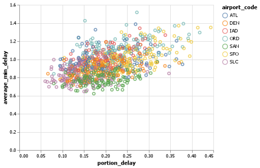
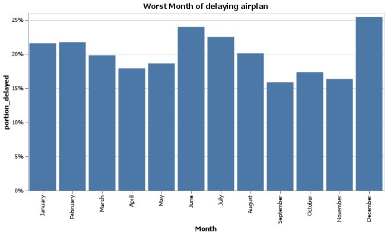
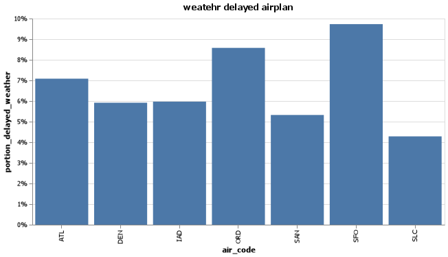

## Elevator pitch
_When using airport, it seems natual to wait airplan for a while without knowing the reason. People try to have more time spaces between flights because of late flight. I can figure out why the flight is late so often using the date. I found the raw and not defined date in the frame and filled out variables so that there have no missing values. when it comes to analyze the data, I reorganize data into right columns so that I expect the reason of late flight and the time of late flight with understading._


### 1. Which airport do you avoid to your trip? 
#### * Define worst delays and showing the table of it
What is the worst delays? It is depends on the frequency and how much times you wait. It is possible to have late flight, but it is not many hours. On the opposition, it is possible to  wait without reasons, but it can be very rare. For adding two values, I would prefer to use SLC or SAN because it shows average of delaying time is less than others and the frequency of delayed flight is less than others. The SFO airport or ORD have high average delayed minites and high proportion of delayed flight. 



| airport_code   |   num_of_flights_total |   num_of_delays_total |   minutes_delayed_total |   portion_delay |   average_min_delay |
|:---------------|-----------------------:|----------------------:|------------------------:|----------------:|--------------------:|
| ATL            |                4430047 |                902443 |                53983926 |         26.6177 |             130.614 |
| DEN            |                2513974 |                468519 |                25173381 |         24.5232 |             116.501 |
| IAD            |                 851571 |                168467 |                10283478 |         25.7612 |             132.428 |
| ORD            |                3597588 |                830825 |                56356129 |         30.2032 |             145.955 |
| SAN            |                 917862 |                175132 |                 8276248 |         25.0415 |             103.492 |
| SFO            |                1630945 |                425604 |                26550493 |         34.4008 |             134.33  |
| SLC            |                1403384 |                205160 |                10123371 |         19.0164 |             108.713 |

- _technic note : understanding to use lambda funcion so that make a new columns._
```python 
por_delay1 = (delay_info
    .assign(
        portion_delay = lambda x : 
        x.num_of_delays_total / x.num_of_flights_total,
        average_min_delay = lambda x :
        x.minutes_delayed_total  / x.num_of_delays_total / 60 )
```
### 2. Do you think the worst month to travel in summer?
#### * Define worst months on each airport and show the chart of it
people usually have their vacation in summer, so people might think summer have more delayed flight. However, the results shows that december is the worst month to travel because flight might delayed in december very often at any airport. Unexpectedly, June is the second proportion of number of delayed flights.



- _technic note : understanding to order list of items and to replaces the axis with different format._
```python 
.encode(
        x =alt.X('month', sort = order_month, title = "Month"),
        y = alt.Y('proportion_delayed', axis = alt.Axis(format= "%"), 
        title="portion_delayed"))
```

### 3. Before the suggestion, clear the date.
The tables shows that the average of number of delayed flight increase when mild weather includes to severe weather.

#### * 3.1 reorganized the column with the mild weather and severe weather from other columns
| airport_code   |   num_of_delays_weather |   num_of_delays_late_aircraft |
|:---------------|------------------------:|------------------------------:|
| ATL            |                245.265  |                      1759.97  |
| DEN            |                104.818  |                      1363.64  |
| IAD            |                 36.3182 |                       491.189 |
| ORD            |                157.311  |                      2043.83  |
| SAN            |                 32.7273 |                       534.856 |
| SFO            |                 78.6136 |                       940.682 |
| SLC            |                 51.75   |                       601.902 |


| airport_code   |   late_plus_weather |   revise_late_arrive |
|:---------------|--------------------:|---------------------:|
| ATL            |             773.257 |             1231.98  |
| DEN            |             513.911 |              954.551 |
| IAD            |             183.675 |              343.833 |
| ORD            |             770.459 |             1430.68  |
| SAN            |             193.184 |              374.399 |
| SFO            |             360.818 |              658.477 |
| SLC            |             232.32  |              421.331 |

#### * 3.2 putting condition on the columns so that discern the right information.
| month     |   num_of_delays_nas |   num_of_delays_weather |
|:----------|--------------------:|------------------------:|
| April     |             1216.4  |                 76.6104 |
| August    |             1395.75 |                111.935  |
| December  |             1563.08 |                131.632  |
| February  |             1408.7  |                115.143  |
| January   |             1468.24 |                126.859  |
| July      |             1523.43 |                137.195  |
| June      |             1610.32 |                134.961  |
| March     |             1373.14 |                 94.1579 |
| May       |             1353.77 |                 88.4156 |
| November  |             1149.79 |                 63.6883 |
| October   |             1322.21 |                 64.7051 |
| September |             1134.66 |                 66.8052 |


| month     |   revise_nas |   nas_plus_weather |
|:----------|-------------:|-------------------:|
| April     |      486.561 |            563.171 |
| August    |      558.301 |            670.236 |
| December  |     1016     |           1147.63  |
| February  |      915.656 |           1030.8   |
| January   |      954.358 |           1081.22  |
| July      |      609.371 |            746.566 |
| June      |      644.13  |            779.091 |
| March     |      892.544 |            986.702 |
| May       |      541.506 |            629.922 |
| November  |      747.365 |            811.053 |
| October   |      859.433 |            924.138 |
| September |      737.531 |            804.336 |

_technic note : understanding to use where function so that condition can be seted either True and False._
```python 
lambda x :
    np.where(
        x.month.isin(["April","May", "June", "July", "August"]), x.num_of_delays_nas * 0.4 ,
        x.num_of_delays_nas * 0.65))
```

### 4. How often can be reason for delayed flight by airport?
#### * group by each airport of the weather delayed flight with accurate information. 
People start to think what is the problem to wait so long when they still can not get any information from the airport. People can assumed, especially SFO, weather can be the reason of delayed flight because the chart shows almost 10% of delayed flight from total number of flights which is high level of it. 



_technic note : understanding to arrage the data from the raw data and to make it group for analyzing._
```python 
pro_weather2 = (weather_total
    .assign(pro_weather = lambda x : x. nas_plus_weather + x. late_plus_weather - x. num_of_delays_weather))

grouped = pro_weather2.groupby('airport_code').sum()
```
### 5. arrange from missing values to accurate date.
#### * missing values can be replace, drop and fill with other values.  
```python
     {
            "index": 2,
            "airport_code": "IAD",
            "airport_name": "",
            "month": "January",
            "year": 2005.0,
            "num_of_flights_total": 12381,
            "num_of_delays_carrier": "414",
            "num_of_delays_late_aircraft": 1058,
            "num_of_delays_nas": 895,
            "num_of_delays_security": 4,
            "num_of_delays_weather": 61,
            "num_of_delays_total": 2430,
            "minutes_delayed_carrier": null,
            "minutes_delayed_late_aircraft": 70919,
            "minutes_delayed_nas": 35660.0,
            "minutes_delayed_security": 208,
            "minutes_delayed_weather": 4497,
            "minutes_delayed_total": 134881
        }
```


### APPENDIX (PYTHON SCRIPT)
```python
import pandas as pd
import altair as alt
import numpy as np
import json

url ="https://github.com/byuidatascience/data4missing/raw/master/data-raw/flights_missing/flights_missing.json"

airport = pd.read_json(url)

# %% missing data
clean_data = airport
clean_data.dropna()
clean_data["month"] = (airport
    .month.replace('n/a', np.nan)
    .fillna(method= 'ffill')
    .replace('Febuary', 'February')
)

clean_data['num_of_delays_late_aircraft'] = (airport
    .num_of_delays_late_aircraft
    .replace(-999, airport.num_of_delays_late_aircraft.mean())
)

clean_data['num_of_flight_total'] = (airport
    .num_of_flights_total.replace(np.nan, np.mean)
)
# %%
''' Which airport has the worst delays? How did you choose to define “worst”? As part of your answer include a table that lists the total number of flights, total number of delayed flights, proportion of delayed flights, and average delay time in hours, for each airport.'''

delay_info = clean_data.filter(['airport_code', 'month','num_of_flights_total','num_of_delays_total','minutes_delayed_total'])

#%%
por_delay = (delay_info
    .assign(
        portion_delay = lambda x : 
        x.num_of_delays_total / x.num_of_flights_total,
        average_min_delay = lambda x :
        x.minutes_delayed_total  / x.num_of_delays_total / 60 )
    .groupby('airport_code').sum()
    .reset_index()
)

print(por_delay.to_markdown(index=False))
#%%
por_delay1 = (delay_info
    .assign(
        portion_delay = lambda x : 
        x.num_of_delays_total / x.num_of_flights_total,
        average_min_delay = lambda x :
        x.minutes_delayed_total  / x.num_of_delays_total / 60 )
    .reset_index()
)

chart1 = (alt.Chart(por_delay1)
    .mark_point()
    .encode(
        x =alt.X ('portion_delay'), 
        y = alt.Y('average_min_delay'), 
        color = 'airport_code')
)

chart1.save("chart1.png")

# %%
'''What is the worst month to fly if you want to avoid delays? Include one chart to help support your answer, with the x-axis ordered by month. You also need to explain and justify how you chose to handle the missing Month data.'''
#%%
order_month= ['January', 'February', 'March', 'April', 'May', 'June', 'July', 'August', 'Octorber','September', 'October', 'November', 'December']
#%%
worst_month = (clean_data
    .assign(proportion_delayed = lambda x : x.
    num_of_delays_total / x.num_of_flights_total)
    .groupby('month').mean()
    .reset_index()
)

chart2 = (alt.Chart(worst_month)
    .mark_bar()
    .encode(
        x =alt.X('month', sort = order_month, title = "Month"),
        y = alt.Y('proportion_delayed', axis = alt.Axis(format= "%"), 
        title="portion_delayed"))
    .properties(
        width = 600, 
        title = "Worst Month of delaying airplan")
)

chart2.save("chart2.png")
# %%
'''According to the BTS website the Weather category only accounts for severe weather delays. Other “mild” weather delays are included as part of the NAS category and the Late-Arriving Aircraft category. Calculate the total number of flights delayed by weather (either severe or mild) using these two rules:

1.30% of all delayed flights in the Late-Arriving category are due to weather.
2. From April to August, 40% of delayed flights in the NAS category are due to weather. The rest of the months, the proportion rises to 65%.'''

#%%
late_info = (clean_data
    .groupby('airport_code').mean()
    .filter(['num_of_delays_weather','num_of_delays_late_aircraft'])
    .reset_index()
)
print(late_info.to_markdown(index=False))
# %%
thirty_late = (clean_data
    .assign(late_plus_weather = lambda x : 
    x. num_of_delays_late_aircraft * 0.3 + x.num_of_delays_weather)
    .assign(revise_late_arrive = lambda x : x. num_of_delays_late_aircraft * 0.7) 
    .groupby('airport_code').mean()
    .filter(['late_plus_weather', 'revise_late_arrive'])
    .reset_index()
)
print(thirty_late.to_markdown(index=False))
#%%
late_info2 = (clean_data
    .groupby('month').mean()
    .filter(['num_of_delays_nas','num_of_delays_weather'])
    .reset_index()
   
)

print(late_info2.to_markdown(index=False))
#%%
forthy_late = (clean_data
    .assign(revise_nas = lambda x :
    np.where(
        x.month.isin(["April","May", "June", "July", "August"]), x.num_of_delays_nas * 0.4 ,
        x.num_of_delays_nas * 0.65))
    .assign(nas_plus_weather = lambda x :
        x. revise_nas + x.num_of_delays_weather )
    .groupby('month').mean()
    .filter(['revise_nas', 'nas_plus_weather'])
    .reset_index()
)
print(forthy_late.to_markdown(index=False))

# %%
'''Create a barplot showing the proportion of all flights that are delayed by weather at each airport. What do you learn from this graph (Careful to handle the missing Late Aircraft data correctly)?'''
# %%
weather_total = (clean_data
    .assign(revise_nas = lambda x :
    np.where(
        x.month.isin(["April","May", "June", "July", "August"]), x.num_of_delays_nas * 0.4 ,
        x.num_of_delays_nas * 0.65))
    .assign(nas_plus_weather = lambda x :
        x. revise_nas + x.num_of_delays_weather )
    .assign(late_plus_weather = lambda x : 
    x. num_of_delays_late_aircraft * 0.3 + x.num_of_delays_weather)
    .assign(revise_late_arrive = lambda x : x. num_of_delays_late_aircraft * 0.7) 
    #.groupby('airport_code').mean()
    #.filter(['nas_plus_weather', 'late_plus_weather'])
    #.reset_index()
)
#%%
pro_weather2 = (weather_total
    .assign(pro_weather = lambda x : x. nas_plus_weather + x. late_plus_weather - x. num_of_delays_weather))

grouped = pro_weather2.groupby('airport_code').sum()
#%%   
grouped['pro_weather_delayed'] = grouped.pro_weather/ grouped.num_of_flights_total 
grouped = grouped.reset_index()
# %%
chart4 = (alt.Chart(grouped)
    .mark_bar()
    .encode(
        x =alt.X ('airport_code', title = "air_code"),
        y = alt.Y('pro_weather_delayed', axis = alt.Axis(format= "%"), 
        title="portion_delayed_weather" ))
        .properties(width = 600, title = "weatehr delayed airplan")
)
chart4.save("chart4.png")
# %%
'''Fix all of the varied NA types in the data to be consistent and save the file back out in the same format that was provided (this file shouldn’t have the missing values replaced with a value). Include one record example from your exported JSON file that has a missing value (No imputation in this file).'''
#%%
json_data= airport.to_json(orient='table')
loading = json.loads(json_data)
print(json.dumps(loading, indent = 4))

''' paste JS 
     {
            "index": 2,
            "airport_code": "IAD",
            "airport_name": "",
            "month": "January",
            "year": 2005.0,
            "num_of_flights_total": 12381,
            "num_of_delays_carrier": "414",
            "num_of_delays_late_aircraft": 1058,
            "num_of_delays_nas": 895,
            "num_of_delays_security": 4,
            "num_of_delays_weather": 61,
            "num_of_delays_total": 2430,
            "minutes_delayed_carrier": null,
            "minutes_delayed_late_aircraft": 70919,
            "minutes_delayed_nas": 35660.0,
            "minutes_delayed_security": 208,
            "minutes_delayed_weather": 4497,
            "minutes_delayed_total": 134881
        }
'''
commented python code from .py file
```