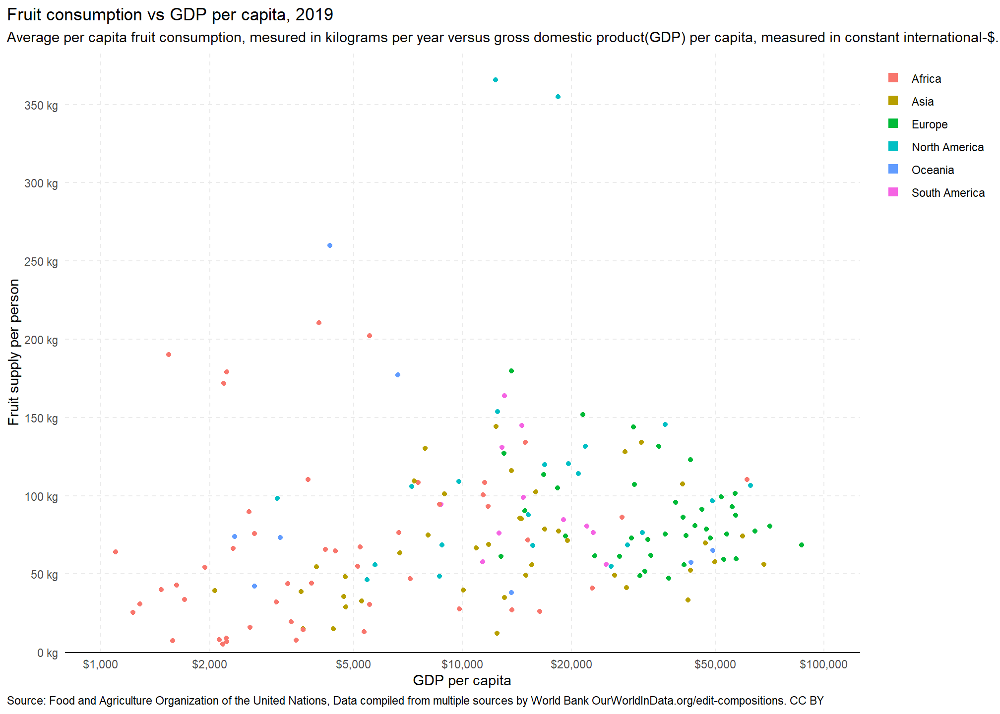
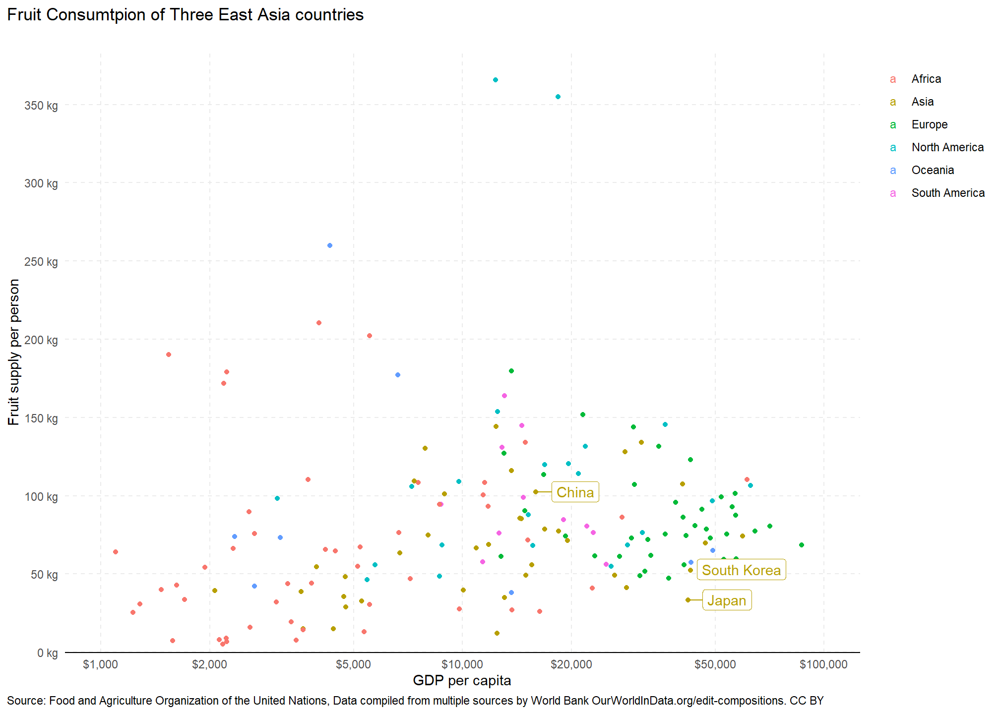
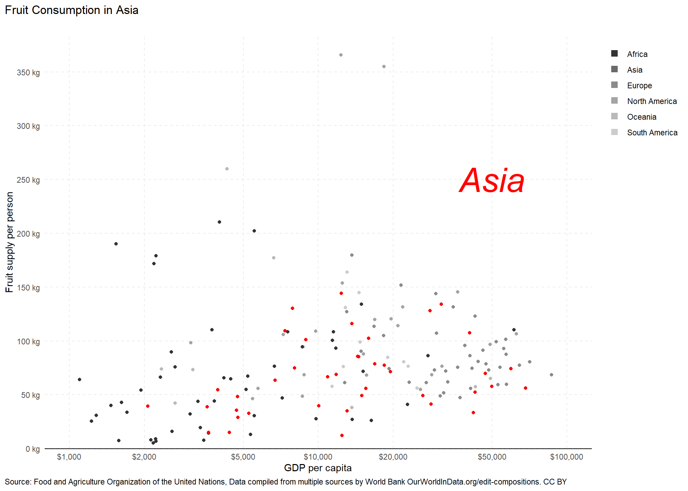

::: {.cell}

```{.r .cell-code}
library(tidyverse)
library(ggplot2)
library(dplyr)
library(pander)
library(ggrepel)
```
:::

### Elevator pitch
I notice that countries in Asia follow the pattern about consuming of fruit. In China, they eat more fruit than Japan and South Korea even though they have less GDP. By making graph, I learned the skills that add annotate and add text in the graph by using a geom_label_repel function. Also, I learned how to design scale on axis in graph1 by using scale continuous.

## Running Code

::: {.cell}

```{.r .cell-code}
df <- read.csv("C:/Users/gakyeong/Documents/GitHub/DS350_WI23_Bae_Gaky/week_05/fruit-consumption-vs-gdp-per-capita.csv")

df1 <- df %>%
  rename(fruit = "Fruit...00002919....Food.available.for.consumption...0645pc....kilograms.per.year.per.capita", gdp = "GDP.per.capita..PPP..constant.2017.international..." )%>% drop_na()
  
df1[df1 == ""]<-NA

df1 <-df1 %>% 
  filter(Year >= 2015)%>%
  fill(Continent, .direction="down")%>%
  filter(Year == 2019)
pander(df1)
```

::: {.cell-output-display}
---------------------------------------------------------------------------------
            Entity                Code     Year   fruit    gdp       Continent   
------------------------------ ---------- ------ ------- -------- ---------------
         Afghanistan              AFG      2019   39.45    2065        Asia      

           Albania                ALB      2019   179.6   13657       Europe     

           Algeria                DZA      2019   108.4   11522       Africa     

            Angola                AGO      2019   76.34    6670       Africa     

     Antigua and Barbuda          ATG      2019   131.7   21850    North America 

          Argentina               ARG      2019   80.54   22066    South America 

           Armenia                ARM      2019    116    13654        Asia      

          Australia               AUS      2019   65.07   49309       Oceania    

           Austria                AUT      2019   92.75   55834       Europe     

          Azerbaijan              AZE      2019   85.5    14442        Asia      

           Bahamas                BHS      2019   145.6   36433    North America 

          Bangladesh              BGD      2019   28.76    4754        Asia      

           Barbados               BRB      2019   68.3    15639    North America 

           Belarus                BLR      2019   74.19   19279       Europe     

           Belgium                BEL      2019   99.09   51944       Europe     

            Belize                BLZ      2019   105.9    7252    North America 

            Benin                 BEN      2019   43.8     3287       Africa     

           Bolivia                BOL      2019   94.48    8724    South America 

    Bosnia and Herzegovina        BIH      2019   90.25   14897       Europe     

           Botswana               BWA      2019   26.18   16348       Africa     

            Brazil                BRA      2019   98.92   14764    South America 

           Bulgaria               BGR      2019   61.66   23266       Europe     

         Burkina Faso             BFA      2019   5.21     2176       Africa     

           Burundi                BDI      2019   79.06   751.7       Africa     

           Cambodia               KHM      2019   14.99    4389        Asia      

           Cameroon               CMR      2019   110.4    3743       Africa     

            Canada                CAN      2019   96.76   49172    North America 

          Cape Verde              CPV      2019   46.86    7172       Africa     

   Central African Republic       CAF      2019   52.44   945.1       Africa     

             Chad                 TCD      2019   7.38     1580       Africa     

            Chile                 CHL      2019   56.3    24968    South America 

            China                 CHN      2019   102.4   15978        Asia      

           Colombia               COL      2019    145    14585    South America 

           Comoros                COM      2019   32.06    3059       Africa     

            Congo                 COG      2019   44.07    3826       Africa     

          Costa Rica              CRI      2019   114.1   20938    North America 

        Cote d'Ivoire             CIV      2019   67.27    5213       Africa     

           Croatia                HRV      2019   72.99   29336       Europe     

            Cyprus                CYP      2019   74.65   41522       Europe     

           Czechia                CZE      2019   55.73   40981       Europe     

 Democratic Republic of Congo     COD      2019   64.21    1098       Africa     

           Denmark                DNK      2019   59.68   57162       Europe     

           Djibouti               DJI      2019   30.44    5535       Africa     

           Dominica               DMA      2019   365.6   12369    North America 

      Dominican Republic          DOM      2019   354.8   18413    North America 

           Ecuador                ECU      2019   57.6    11371    South America 

            Egypt                 EGY      2019   93.34   11763       Africa     

         El Salvador              SLV      2019   68.48    8776    North America 

           Estonia                EST      2019   75.44   36401       Europe     

           Eswatini               SWZ      2019   94.51    8653       Africa     

           Ethiopia               ETH      2019   8.81     2221       Africa     

             Fiji                 FJI      2019   38.21   13684       Oceania    

           Finland                FIN      2019   73.06   48583       Europe     

            France                FRA      2019   91.16   46018       Europe     

            Gabon                 GAB      2019   134.1   14946       Africa     

            Gambia                GMB      2019   6.841    2225       Africa     

           Georgia                GEO      2019   49.31   14989        Asia      

           Germany                DEU      2019   75.48   53930       Europe     

            Ghana                 GHA      2019   202.3    5540       Africa     

            Greece                GRC      2019    144    29698       Europe     

           Grenada                GRD      2019   119.7   16868    North America 

          Guatemala               GTM      2019   48.54    8653    North America 

            Guinea                GIN      2019   89.86    2567       Africa     

        Guinea-Bissau             GNB      2019   54.21    1939       Africa     

            Guyana                GUY      2019    164    13082    South America 

            Haiti                 HTI      2019   98.42    3073    North America 

           Honduras               HND      2019   55.77    5736    North America 

          Hong Kong               HKG      2019   74.32   59586        Asia      

           Hungary                HUN      2019   71.83   32554       Europe     

           Iceland                ISL      2019   87.39   56936       Europe     

            India                 IND      2019   63.55    6714        Asia      

          Indonesia               IDN      2019   68.97   11812        Asia      

             Iran                 IRN      2019   144.2   12389        Asia      

             Iraq                 IRQ      2019   66.71   10936        Asia      

           Ireland                IRL      2019   68.41   86650       Europe     

            Israel                ISR      2019   107.4   40626        Asia      

            Italy                 ITA      2019    123    42708       Europe     

           Jamaica                JAM      2019    109     9777    North America 

            Japan                 JPN      2019   33.35   42022        Asia      

            Jordan                JOR      2019   39.81   10071        Asia      

          Kazakhstan              KAZ      2019   49.3    26352        Asia      

            Kenya                 KEN      2019   64.68    4453       Africa     

           Kiribati               KIR      2019   73.91    2340       Oceania    

            Kuwait                KWT      2019   57.73   49854        Asia      

          Kyrgyzstan              KGZ      2019   32.63    5258        Asia      

             Laos                 LAO      2019   130.2    7887        Asia      

            Latvia                LVA      2019    49     31012       Europe     

           Lebanon                LBN      2019   85.26   14564        Asia      

           Lesotho                LSO      2019   16.02    2584       Africa     

           Liberia                LBR      2019   40.14    1470       Africa     

            Libya                 LBY      2019   71.53   15174       Africa     

          Lithuania               LTU      2019   47.31   37166       Europe     

          Luxembourg              LUX      2019   86.87   116518      Europe     

            Macao                 MAC      2019   57.34   127273       Asia      

          Madagascar              MDG      2019   42.9     1619       Africa     

            Malawi                MWI      2019   190.1    1537       Africa     

           Malaysia               MYS      2019   41.15   28421        Asia      

           Maldives               MDV      2019   71.31   19510        Asia      

             Mali                 MLI      2019   66.26    2322       Africa     

            Malta                 MLT      2019   80.94   43951       Europe     

          Mauritania              MRT      2019   13.13    5344       Africa     

          Mauritius               MUS      2019   40.98   22870       Africa     

            Mexico                MEX      2019   120.3   19677    North America 

           Moldova                MDA      2019   127.2   13027       Europe     

           Mongolia               MNG      2019   12.08   12486        Asia      

          Montenegro              MNE      2019   151.8   21534       Europe     

           Morocco                MAR      2019   108.5    7547       Africa     

          Mozambique              MOZ      2019   30.85    1282       Africa     

           Myanmar                MMR      2019   48.29    4740        Asia      

           Namibia                NAM      2019   27.62    9813       Africa     

            Nepal                 NPL      2019   54.71    3953        Asia      

         Netherlands              NLD      2019   101.6   56784       Europe     

         New Zealand              NZL      2019   57.38   42878       Oceania    

          Nicaragua               NIC      2019   46.46    5452    North America 

            Niger                 NER      2019   25.32    1224       Africa     

           Nigeria                NGA      2019   54.93    5135       Africa     

        North America              NA      2019   110.5   61251       Africa     

       North Macedonia            MKD      2019   113.6   16773       Europe     

            Norway                NOR      2019   77.24   64385       Europe     

             Oman                 OMN      2019   134.1   31284        Asia      

           Pakistan               PAK      2019   35.6     4698        Asia      

            Panama                PAN      2019   76.47   31440    North America 

       Papua New Guinea           PNG      2019   259.8    4293       Oceania    

           Paraguay               PRY      2019   76.08   12616    South America 

             Peru                 PER      2019   130.9   12854    South America 

         Philippines              PHL      2019    101     8915        Asia      

            Poland                POL      2019   61.83   33185       Europe     

           Portugal               PRT      2019   131.6   34946       Europe     

           Romania                ROU      2019   107.1   29875       Europe     

            Russia                RUS      2019   61.24   27211       Europe     

            Rwanda                RWA      2019   179.2    2228       Africa     

    Saint Kitts and Nevis         KNA      2019   68.42   28603    North America 

         Saint Lucia              LCA      2019   87.97   15201    North America 

    Saint Vincent and the         VCT      2019   153.9   12489    North America 
          Grenadines                                                             

            Samoa                 WSM      2019   177.3    6632       Oceania    

    Sao Tome and Principe         STP      2019   210.3    4005       Africa     

         Saudi Arabia             SAU      2019   69.65   46962        Asia      

           Senegal                SEN      2019   19.36    3361       Africa     

            Serbia                SRB      2019    105    18307       Europe     

          Seychelles              SYC      2019   86.19   27611       Africa     

         Sierra Leone             SLE      2019   33.74    1705       Africa     

           Slovakia               SVK      2019   51.61   31928       Europe     

           Slovenia               SVN      2019   95.6    38947       Europe     

       Solomon Islands            SLB      2019   42.1     2661       Oceania    

         South Africa             ZAF      2019   27.14   13710       Africa     

         South Korea              KOR      2019   52.2    42759        Asia      

            Spain                 ESP      2019   86.24   40802       Europe     

          Sri Lanka               LKA      2019   34.97   13070        Asia      

            Sudan                 SDN      2019   65.78    4174       Africa     

           Suriname               SUR      2019   84.8    19037    South America 

            Sweden                SWE      2019   59.33   52851       Europe     

         Switzerland              CHE      2019   80.39   70944       Europe     

          Tajikistan              TJK      2019   38.6     3581        Asia      

           Tanzania               TZA      2019   75.93    2661       Africa     

           Thailand               THA      2019   77.51   18453        Asia      

            Timor                 TLS      2019   14.87    3627        Asia      

             Togo                 TGO      2019   8.13     2122       Africa     

     Trinidad and Tobago          TTO      2019   55.02   25828    North America 

           Tunisia                TUN      2019   100.6   11417       Africa     

            Turkey                TUR      2019   128.2   28197        Asia      

         Turkmenistan             TKM      2019   55.94   15538        Asia      

            Uganda                UGA      2019   171.9    2183       Africa     

           Ukraine                UKR      2019   61.14   12805       Europe     

     United Arab Emirates         ARE      2019   56.07   68264        Asia      

        United Kingdom            GBR      2019   78.78   47369       Europe     

        United States             USA      2019   106.7   62631    North America 

           Uruguay                URY      2019   76.34   23033    South America 

          Uzbekistan              UZB      2019   109.4    7348        Asia      

           Vanuatu                VUT      2019   73.35    3137       Oceania    

           Vietnam                VNM      2019   74.91    8041        Asia      

            World               OWID_WRL   2019   78.72   16897        Asia      

            Zambia                ZMB      2019   7.59     3470       Africa     

           Zimbabwe               ZWE      2019   14.33    3630       Africa     
---------------------------------------------------------------------------------
:::
:::

::: {.cell}

```{.r .cell-code}
graph1 <- ggplot(data=df1, mapping=aes(x=gdp, y=fruit, color =Continent))+
  geom_point()+
  scale_x_continuous(trans = "log",
                     breaks = c(1000,2000,5000,10000,20000,50000,100000),
                     limits = c(1000, 100000),
                     labels = scales::dollar_format(accuracy =1))+
  scale_y_continuous(breaks = seq(0, 350, 50),
                     labels=c("0 kg","50 kg", "100 kg", "150 kg", "200 kg", "250 kg","300 kg", "350 kg"),
                    #unit_format(suffix ="kg")
                    #labels= function(y)(paste(y,"kg", sep=" ")
                    #labels = `paste(.x, "kg", sep =" ")
                     expand = expansion(mult = c(0.015, .05)) # default is .05 is either end
                    
                    )+
  theme_minimal()+
  theme(axis.line.x.bottom = element_line(color = "black"),
        panel.grid = element_line(linetype = "dashed"),
        panel.grid.minor = element_blank(),
        legend.justification = "top",
        plot.caption = element_text(hjust = 0),
        plot.title.position = "plot",
        plot.caption.position = "plot"
        )+
  guides(color= guide_legend(override.aes = list(shape = 15, size = 3)))+
  labs(color = NULL, 
       title = "Fruit consumption vs GDP per capita, 2019",
       subtitle = "Average per capita fruit consumption, mesured in kilograms per year versus gross domestic product(GDP) per capita, measured in constant international-$.",
       x="GDP per capita",
       y="Fruit supply per person",
       caption = "Source: Food and Agriculture Organization of the United Nations, Data compiled from multiple sources by World Bank OurWorldInData.org/edit-compositions. CC BY")

graph1
```

::: {.cell-output-display}
{width=1008}
:::
:::


### graph2

::: {.cell}

```{.r .cell-code}
p1 <- df1%>%
  filter(Entity %in% c("China", "South Korea", "Japan"))

#graph1 + geom_label(p1, mapping =aes(gdp, fruit, label = Entity), nudge_x = 0.25,nudge_y = 0.25, check_overlap = T)

graph2 <- graph1+geom_label_repel(p1, mapping =aes(gdp, fruit, label = Entity), nudge_x = 0.25,nudge_y = 0.25)+ labs(title = "Fruit Consumtpion of Three East Asia countries", subtitle = "")
graph2
```

::: {.cell-output-display}
{width=1008}
:::
:::

graph2) I tried to highlights to three countries which are China, South Korea, Japan.


### graph3

::: {.cell}

```{.r .cell-code}
p2 <- df1%>%
  filter(Continent =="Asia")

graph3 <- graph1 +scale_colour_grey()+
  geom_point(data=p2, mapping=aes(x=gdp, y=fruit), color = "red")+
  labs(title = "Fruit Consumption in Asia", subtitle = "")+
  annotate(geom="text", x=50000, y=250, label="Asia",
              color="red", fontface="italic", size= 13)
graph3
```

::: {.cell-output-display}
{width=1008}
:::
:::

graph3) I emphasizes on continent "Asia". 


