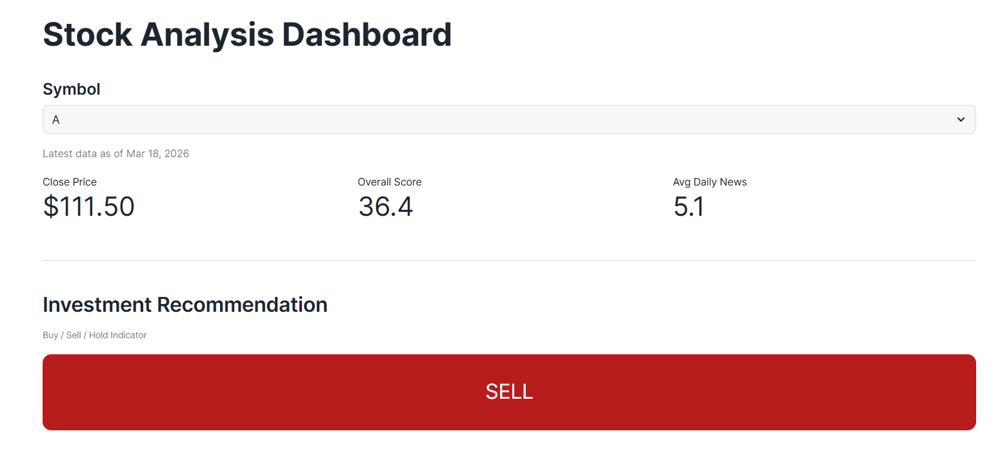
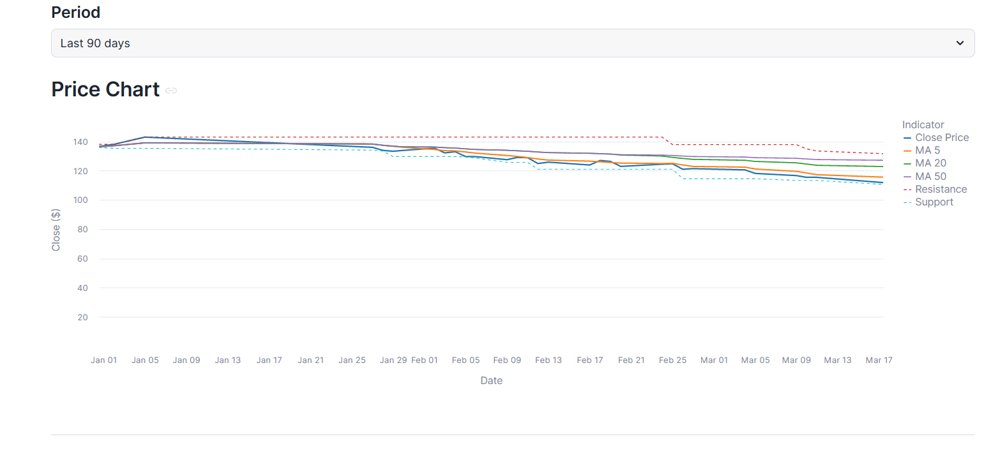
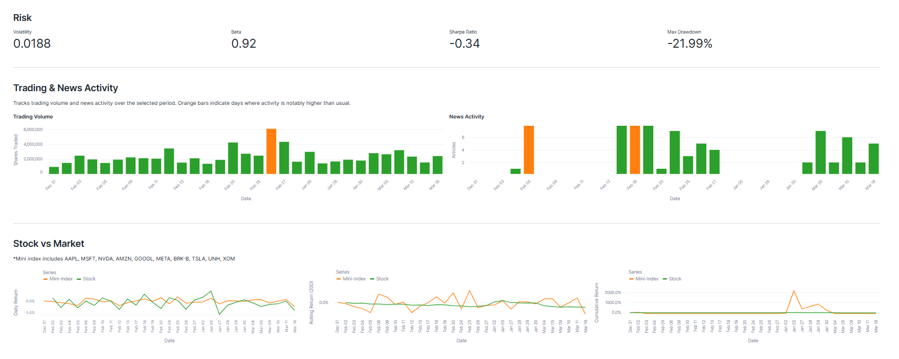
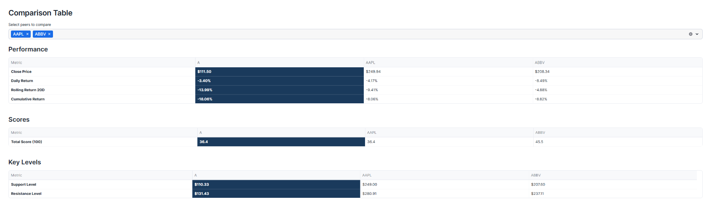
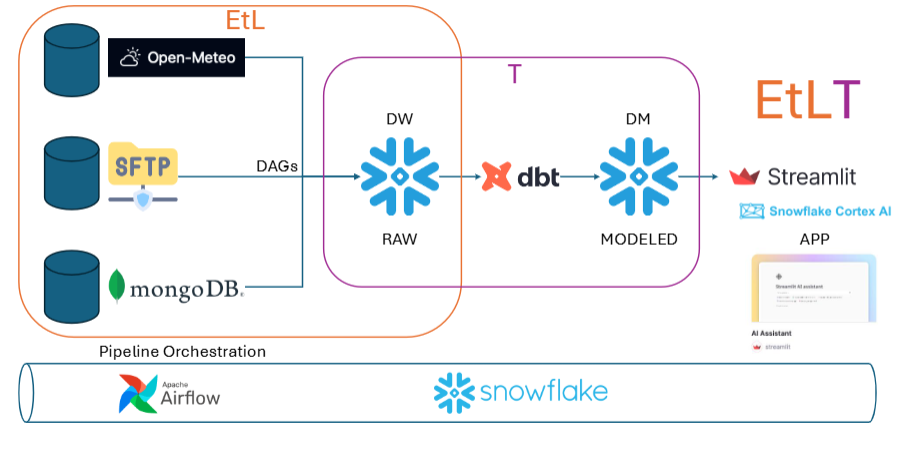

## Stock analysis Dashboard
The stock analysis tool I built in Streamlit takes all the messy, complicated market data and turns it into a clear, easy‑to‑read snapshot of how a stock is doing. Instead of making users jump between charts and numbers, everything—performance, trends, and comparisons—is organized in one clean dashboard. The overall score and Buy/Hold/Sell signal give a quick sense of whether a stock looks strong or risky, and the AI commentary explains what’s happening in plain language. This helps everyday investors save time, avoid confusion, and make smarter decisions with confidence. The main selling point is simple: it makes professional‑level analysis fast, understandable, and accessible to anyone.

{width="100%"}
{width="100%"}
{width="100%"}
{width="100%"}

### Process
{width="100%"}

The project begins with **data ingestion**, where external sources such as Open‑Meteo and other **APIs** provide raw weather or market data. This raw data is first collected through an **EtLT** pipeline, meaning the system extracts the data, performs lightweight transformations if needed, and then loads it into the **RAW layer** of **Snowflake**. In some cases, data may arrive through **SFTP** and **MongoDB**, where files are dropped into a secure folder and automatically picked up by the pipeline. **Apache Airflow** orchestrates these ingestion tasks using **DAGs**, ensuring that data is pulled on a schedule, validated, and stored consistently.

Once the raw data is inside Snowflake, the next stage is data transformation and modeling. This is where **dbt** plays a central role. dbt takes the raw tables and applies business logic, cleaning steps, joins, and calculations to produce the MODELED layer. These modeled tables are structured for analytics — for example, combining weather data with time dimensions, or preparing stock data with rolling averages and cumulative metrics. dbt ensures that every transformation is version‑controlled, testable, and reproducible, which is essential for a production‑ready data warehouse.

After the data is modeled, it becomes available for downstream applications. **Streamlit** application acts as the front‑end interface for end users. Streamlit connects to Snowflake to pull the modeled data and visualize it through charts, tables, and interactive components. This is where users can explore trends, compare metrics, and interact with the data in real time.

The final layer of the product integrates Snowflake Cortex AI and your Streamlit AI assistant. **Cortex AI** provides natural‑language commentary, sentiment scoring, and automated insights directly on top of the modeled data. In Streamlit, this appears as an AI assistant that explains trends, summarizes performance, or answers user questions about the data. This transforms the dashboard from a static visualization tool into an intelligent decision‑support system.