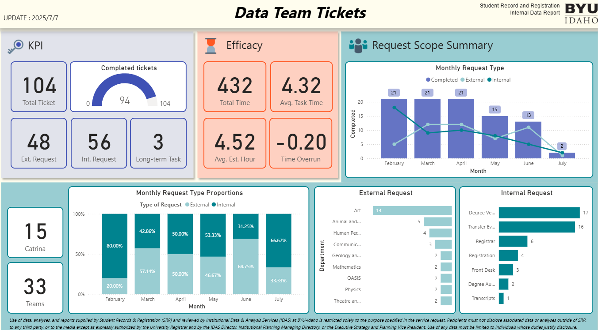
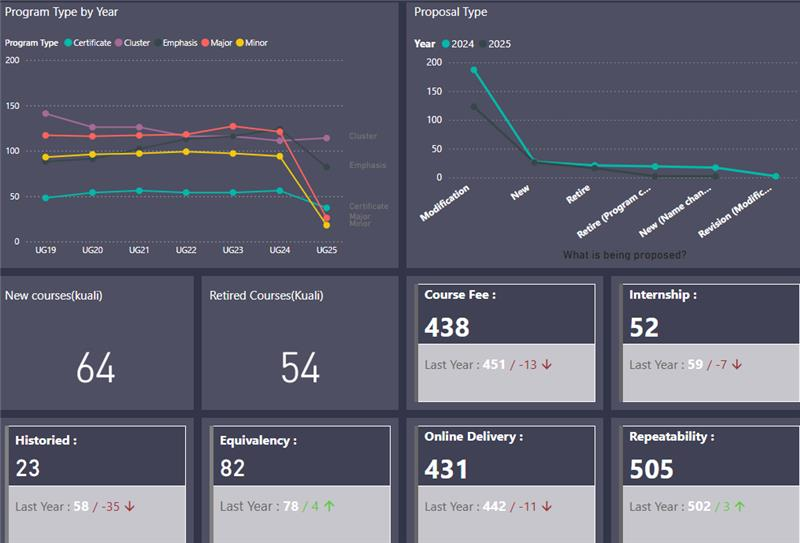
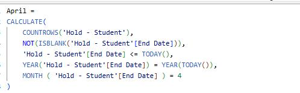
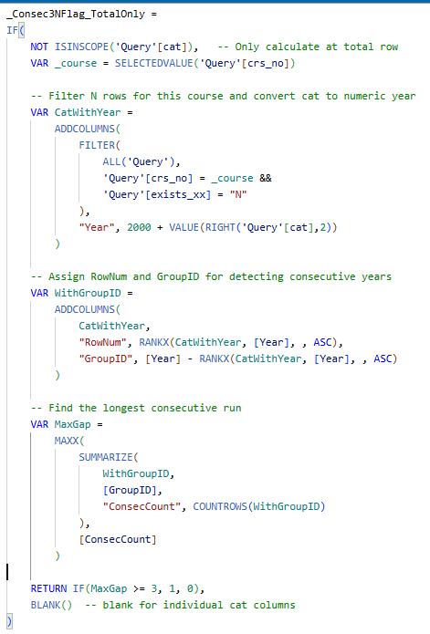
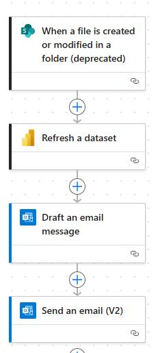

## Ticket Dashboard
The Ticket Dashboard provides a centralized view of all support tickets, allowing teams to monitor, track, and manage requests efficiently. It displays key metrics such as ticket status, Request type, and response times.

## Informer Dashboard
The Informer Dashboard provides an interactive overview of curriculum updates and changes across academic years. It allows educators and administrators to track modifications in changes year and year. By providing a clear view of curriculum progression, it supports data-driven decisions, ensures alignment with standards, and helps stakeholders plan effectively for upcoming academic years.

::: {.cell-output-display}
{width=1008}
:::

## DAX 
In report, I used DAX to analyze case holds over time. I calculated monthly counts of cases on hold, allowing for easy monitoring of trends and workload fluctuations. 
Additionally, I implemented three-year flags to identify cases that have not been on scheduled across multiple years, highlighting long-standing or recurring issues. 

::: {.cell-output-display}
{width=1008}
{width=1008}
:::

## Power Automate
I leveraged Power Automate to streamline the processing of the the Report. By automating data transformation, I was able to reduces manual effort, ensures consistency across reports, and allows for timely updates. 

::: {.cell-output-display}
{height=380}
:::
